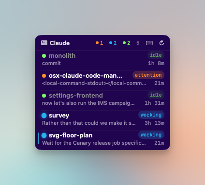
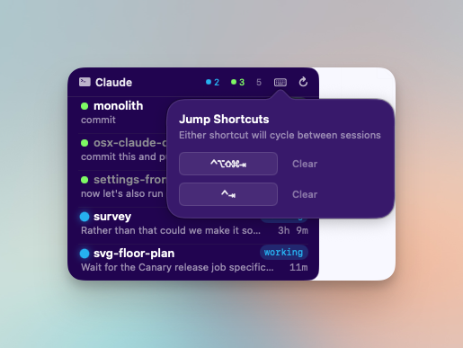

<div align="center">

# Claude Monitor

**A floating macOS dashboard for all your Claude Code sessions.**

See what's working, what's idle, and what needs attention — at a glance.

<br>



<br>
<br>

</div>

---

If you run multiple Claude Code sessions at once, you know the pain: switching tabs to check which one finished, which one is waiting for permission, which one is still thinking. Claude Monitor fixes that.

A tiny always-on-top panel you can drag anywhere on your screen. It shows every active Claude Code session with its status, project name, and last prompt. Click a row to jump straight to that terminal tab.

<div align="center">

<br>
<sub>Configurable global keyboard shortcuts to cycle between sessions</sub>
</div>

## Features

- **Live status** for every session — working, idle, or needs attention — with color-coded dots
- **Click to jump** to any session's terminal tab (Ghostty, iTerm2, Terminal.app)
- **Global keyboard shortcuts** to cycle between sessions needing attention
- **Team agent badges** when sessions spawn sub-agents
- **Project name, elapsed time, and last prompt** preview per session
- **Kill any session** with one click (hover to reveal the X)
- **Always-on-top** dark glass panel, visible on all Spaces, no dock icon
- **Auto-discovery** via JSONL scanning — sessions appear without manual refresh

## Install

### Requirements

- **macOS 14+** (Sonoma or later)
- **[Claude Code](https://docs.anthropic.com/en/docs/claude-code)** CLI
- **Xcode Command Line Tools** — `xcode-select --install`
- **jq** — `brew install jq`
- **Ghostty, iTerm2, or Terminal.app**

### Setup

```bash
git clone https://github.com/SimeonC/claude-monitor.git
cd claude-monitor
./install.sh
```

The install script is idempotent — it creates directories, merges hooks into `~/.claude/settings.json`, builds the binary, installs a LaunchAgent, and starts the monitor. Run the same command to update.

The floating panel appears in the top-right corner. Drag to reposition — it remembers where you put it.

#### Fish shell

If you use [fish](https://fishshell.com/), run the fish integration script after the main install:

```bash
./install_fish.sh
```

This installs `claude.fish` to `~/.config/fish/functions/`, which wraps the `claude` command with tmux session management and session ID tracking for the monitor.

### Uninstall

```bash
pkill claude_monitor
rm -rf ~/.claude/monitor ~/.claude/hooks/monitor.sh
launchctl bootout "gui/$(id -u)/com.claude.monitor" 2>/dev/null
rm -f ~/Library/LaunchAgents/com.claude.monitor.plist
```

Then remove the hook entries from `~/.claude/settings.json`.

## How It Works

Claude Code hooks fire on session events → `monitor.sh` writes session JSON to `~/.claude/monitor/sessions/` → the Swift app detects changes via FSEvents and updates the floating panel. Session files are never deleted — status transitions replace destructive removal to prevent race conditions in concurrent hooks.

## Credits

Originally created by [brb-dreaming](https://github.com/brb-dreaming/claude-monitor). This fork has diverged significantly with keyboard shortcuts, team agent support, session auto-discovery, and many other changes.

## License

[MIT](LICENSE)
